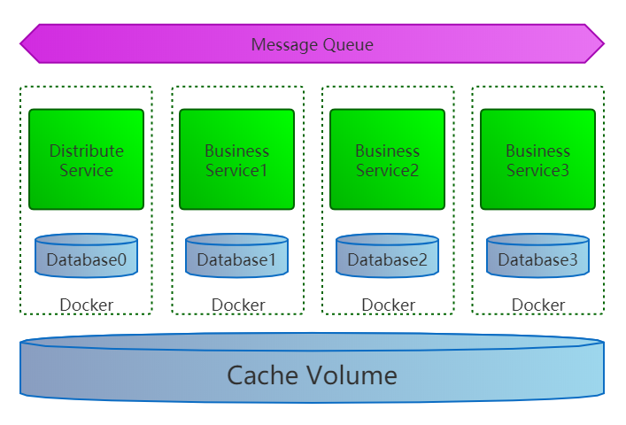
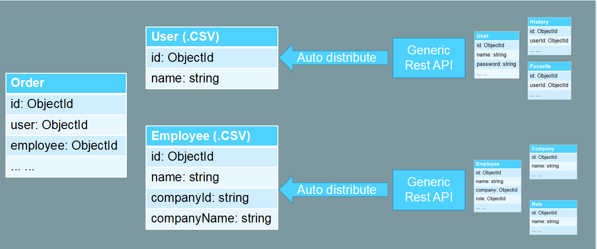

# [数据驱动的微服务架构 <br/> (Data Driven Microservice)](https://aiportal.github.io/data-driven-service/)


<br/>

**[Data Driven Microservice](https://aiportal.github.io/data-driven-service/) 构建在 [Generic REST API](https://aiportal.github.io/generic-rest-api/)   和 [ETag cache service](https://aiportal.github.io/etag-cache-service/) 技术之上，利用数据库的外部表扩展功能（例如 [PostgreSQL](https://www.postgresql.org/docs/) 的 [file-fdw](https://www.postgresql.org/docs/current/file-fdw.html)），使用异步数据交互代替同步接口调用，旨在简化和统一微服务与微服务之间的信息交互过程。**

**[Data Driven Microservice](https://aiportal.github.io/data-driven-service/) 避免了微服务与微服务之间的直接调用，可以让开发人员在保留现有开发模式和开发习惯的前提下，使用熟悉的 [SQL join](https://www.w3schools.com/sql/sql_join.asp) 操作直接使用其他微服务提供的数据。**

<br/>

## 系统架构示意图



* 缓存共享卷 (Cache Volume) 被多个容器共享，存储由 [缓存部署服务 (Distribute Service)]((https://aiportal.github.io/etag-cache-service/)) 维护和更新的 CSV 缓存文件。

* 每个业务子系统 (Business Service) 都有自己的 [PostgreSQL](https://www.postgresql.org/docs/) 数据库实例，维护自身需要的业务数据。
该 [PostgreSQL](https://www.postgresql.org/docs/) 数据库使用 [file-fdw](https://www.postgresql.org/docs/current/file-fdw.html) 引用存储于缓存共享卷 (Cache Volume) 中的 CSV 文件，读取其他业务子系统 (Business Service) 输出的数据。

* 缓存部署服务 (Distribute service) 依照 [ETag cache service](https://aiportal.github.io/etag-cache-service/) 中的缓存更新策略，自动维护缓存共享卷 (Cache Volume) 中的数据。

<br/>

## 业务数据库设计示例



* Business Service1 包含 Employee, Company, Role 三个数据表，Business Service2 包含 User, History, Favorite 三个数据表，Bussiness Service3 包含 Order 数据表，同时引用了来自 Business Service1 的 Employee.csv 缓存数据和来自 Business Service2 的 User.csv 缓存数据。

* CSV 缓存数据成为各业务子系统之间的交互协议。在协议有效的前提下，任一子系统均可独立升级、扩展。

<br/>

## 创建外部表

* 以 [PostgreSQL](https://www.postgresql.org/docs/) 为例，使用 [file-fdw](https://www.postgresql.org/docs/current/file-fdw.html) 插件创建外部数据表。

* 首先进入 [psql](https://www.postgresql.org/docs/current/app-psql.html) 命令行，使用以下指令安装 [file-fdw](https://www.postgresql.org/docs/current/file-fdw.html) 插件。

``` sql
CREATE EXTENSION file_fdw;
CREATE SERVER file_fdw_server FOREIGN DATA WRAPPER file_fdw;
```

* 然后按照要获取的数据结构，在当前数据库中创建外部表。
(OPTIONS 中的 filename 参数定义了 CSV 文件所在的路径)

```
create foreign table Employee
(
  id    uuid not null,
  name  varchar(50),
  companyId uuid,
  companyName varchar(50),
)SERVER file_fdw_server
OPTIONS (format 'csv',header 'false',filename '/cache/rest/employee.csv', delimiter ',', null '');
```

<br/>

## 生成数据

* 扩展 [Generic REST API](https://aiportal.github.io/etag-cache-service/) 的接口设计，支持数据列平铺和 CSV 格式输出。

* 将 [Generic REST API](https://aiportal.github.io/etag-cache-service/) 查询参数中的 fields 参数内容使用圆括号括起。括起后的 fields 参数中，嵌套列必须使用圆括号，点操作符后面表示列的别名。如果出现 `.(` 操作符，表示将括号内的嵌套列展开到上一层。例如：  

`GET /employees?fields=(id,name,company.(id.companyId,name.companyName))`
```
{
  "id": "5dbf8d279223892968bba2e5",
  "name": "Grand Li",
  "companyId": "5d77a5800a1cbe995321446b",
  "companyName": "Headquarters",
}
```

* 扩展 [Generic REST API](https://aiportal.github.io/etag-cache-service/) 的服务端实现，通过对 [Content negotiation](https://developer.mozilla.org/en-US/docs/Web/HTTP/Content_negotiation) 机制的支持，实现 CSV 格式内容输出。例如：

```
GET /employees?fields=(id,name,company.(id.companyId,name.companyName))

Accept: text/csv
```

```
"5dbf8d279223892968bba2e5","Grand Li","5d77a5800a1cbe995321446b","Headquarters"
```

<br/>

## 其他

* 以上设计方案中，要求每个业务子系统 (Business Service) 都实现 [Generic REST API](https://aiportal.github.io/etag-cache-service/) 和 [ETag cache service](https://aiportal.github.io/etag-cache-service/) 协议，这对于现有系统的改造很不友好，需要大量的开发工作。可以考虑使用 [PostgREST](http://postgrest.org/en/v6.0/) 框架代替 [Generic REST API](https://aiportal.github.io/etag-cache-service/) 协议，自动实现
 [RESTful](https://restfulapi.net/) 模式的数据访问接口。

* 使用 [PostgreSQL](https://www.postgresql.org/docs/) 的 [postgres-fdw](https://www.postgresql.org/docs/9.5/postgres-fdw.html) 插件也可以直接引用其他 [PostgreSQL](https://www.postgresql.org/docs/) 数据库中的数据，跳过 Distribute Service 实现类似目的。此种方式灵活性稍差，但却是最为简单的一种实现方式。

<br/><br/><br/>