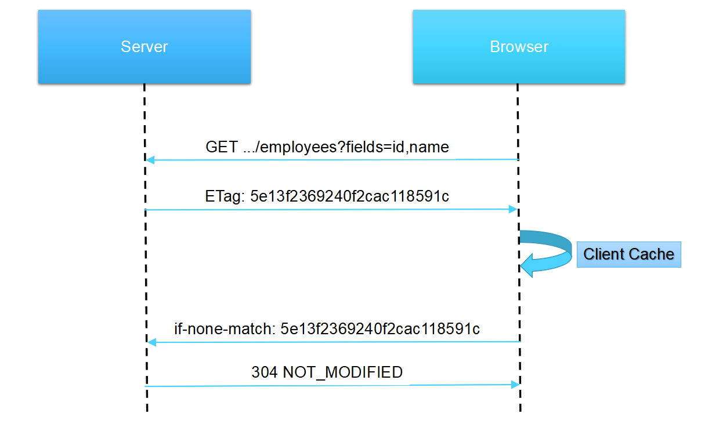
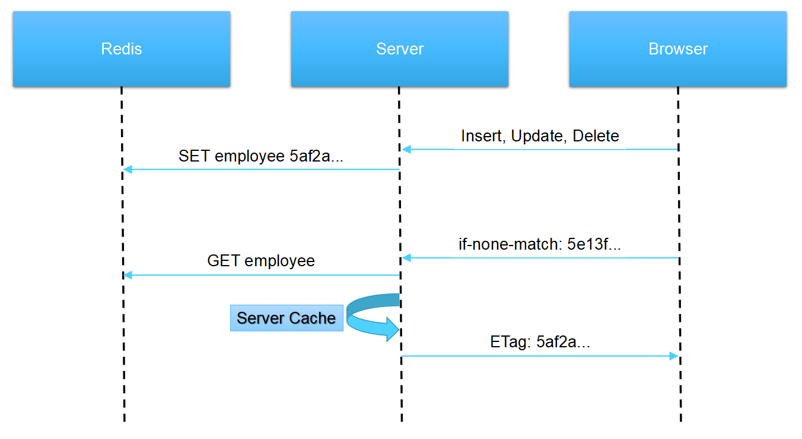

# [ETag 缓存服务设计 <br/> (ETag cache service)](https://aiportal.github.io/etag-cache-service/)

<br/>

[ETag cache service](https://aiportal.github.io/etag-cache-service/) 是为 [RESTful](https://restfulapi.net/) 接口协议设计的一套缓存策略，它可以有效降低服务端的运算负载，提高浏览器端的使用体验。

建议结合 [Generic REST API](https://aiportal.github.io/generic-rest-api/) 使用，效果更佳。

<br/>

[HTTP headers](https://developer.mozilla.org/en-US/docs/Web/HTTP/Headers) 定义了多个用于实现浏览器缓存的关键字，[Expires](https://developer.mozilla.org/en-US/docs/Web/HTTP/Headers/Expires) 和 [max-age](https://developer.mozilla.org/en-US/docs/Web/HTTP/Headers/Cache-Control) 等都是基于过期时间的缓存策略，当内容过期的时间没有规律且无法预测时，该缓存方式无法满足需求。

[ETag](https://developer.mozilla.org/en-US/docs/Web/HTTP/Headers/ETag) 和 [If-None-Match](https://developer.mozilla.org/en-US/docs/Web/HTTP/Headers/If-None-Match) 属性基于一个自定义的字符串实现缓存控制，浏览器每次请求都会带上这个字符串询问服务端是否需要更新缓存。

当浏览器端发起缓存校验的请求时，服务端会返回 [200 ok](https://developer.mozilla.org/en-US/docs/Web/HTTP/Status/200) 表示返回正常的结果或者 [304 Not Modified](https://developer.mozilla.org/en-US/docs/Web/HTTP/Status/304) (不返回body) 表示浏览器可以使用本地缓存文件。

<br/>

## 浏览器缓存

* 浏览器首次访问时，服务端返回请求数据，并携带 [ETag](https://developer.mozilla.org/en-US/docs/Web/HTTP/Headers/ETag) 属性。

* 浏览器收到 ETag 属性后，自动缓存数据。

* 浏览器再次访问时，请求头中包含 [If-None-Match](https://developer.mozilla.org/en-US/docs/Web/HTTP/Headers/If-None-Match) 属性，如果服务器返回 [304 Not Modified](https://developer.mozilla.org/en-US/docs/Web/HTTP/Status/304) (不返回body)，浏览器就直接使用本地已缓存的数据。



<br/>

## 服务端缓存

* 浏览器缓存可以有效降低服务端的运算负载，减少数据库的查询次数，但多个客户端发起请求时，服务端仍需多次执行相同的查询运算。在浏览器缓存的基础上增加服务端缓存，可以进一步降低服务端的运算负载。

* 服务端使用 [Redis](https://redis.io/) 存储资源版本号，每次有资源更新操作发生时，自动更新 [Redis](https://redis.io/) 中的版本字符串。

* 浏览器端发起缓存校验的请求时，服务端比较 [If-None-Match](https://developer.mozilla.org/en-US/docs/Web/HTTP/Headers/If-None-Match) 属性和 [Redis](https://redis.io/) 中的资源版本字符串，决定返回 [304 Not Modified](https://developer.mozilla.org/en-US/docs/Web/HTTP/Status/304) 还是执行数据库查询。  

* 服务端每次执行数据库查询后，自动缓存一份数据副本，下次遇到 [URL](https://developer.mozilla.org/en-US/docs/Learn/Common_questions/What_is_a_URL) 相同且 [If-None-Match](https://developer.mozilla.org/en-US/docs/Web/HTTP/Headers/If-None-Match) 属性一致的请求时，直接将缓存数据发送给浏览器。 



<br/>

## 代码示例

``` typescript
  /**
   * update resource version
   * @param name resource name
   */
  public static async update(name: string): Promise<void> {
    const key = `resource:${name}`;
    const etag = md5(`${name}-${Date.now()}-${Math.random().toString()}`);
    await redis.setAsync(key, etag);
  }

  /**
   * if fresh, request new data.
   * @param ctx http context
   * @param name resource name
   * @param relations related resource names
   * @returns resource has new version 
   */
  public static async fresh(ctx: any, name: string, ...relations: string[]): Promise<boolean> {
    // check etag version
    const values = await Promise.all(
      [name, ...relations].map(async (x) => {
        return await redis.getAsync(`resource:${x}`);
      }),
    );
    const version = _.isEmpty(values) ? 'default' : md5(values.join(','));
    const etag = `${name}-${version}`;

    ctx.response.set('Cache-Control', 'private');
    ctx.response.set('ETag', etag);

    // if client cache exists, return 304
    if (ctx.request.headers['if-none-match'] === etag) {
      ctx.status = NOT_MODIFIED;
      return false;
    }

    // if server cached, return content from cache.
    const cache = await EtagService.cacheGet(ctx.url, etag);
    if (cache) {
      ctx.body = cache;
      return false;
    }

    return true;
  }
```

具体代码请参见：[https://gist.github.com/aiportal/6b7149833d3676e1fc38ce2ad733f640](https://gist.github.com/aiportal/6b7149833d3676e1fc38ce2ad733f640)

<br/>

## 缓存数据的自动部署

* 如果浏览器缓存和服务端缓存均为失效状态，且数据库查询耗时较长，此时并发涌入的查询请求仍会引发数据库的多次运算。

* 浏览器端的数据查询请求在多数情况下可以立即响应，但偶尔遭遇缓存失效时仍需耐心等待，这在数据库查询耗时较长的情况下很影响用户体验。

<br/>

要解决以上问题，可以在数据库中添加一个缓存信息表。name 列存储资源名称，url 列存储 [GET](https://developer.mozilla.org/en-US/docs/Web/HTTP/Methods/GET) 请求的 [URL](https://developer.mozilla.org/en-US/docs/Learn/Common_questions/What_is_a_URL)，version 列存储服务端缓存的当前版本。

| name | url | version |
| :--- | :--- | :------ |
| &nbsp; employee &nbsp; | &nbsp; /employees?fields=id,name,employee(id,name),role &nbsp; | &nbsp; 6b7149833d3676e1fc38ce2ad733f640 &nbsp; |
| &nbsp; employee &nbsp; | &nbsp; /employees/{id}?fields=id,name,employee,role(id,name) &nbsp; | &nbsp; 6b7149833d3676e1fc38ce2ad733f640 &nbsp; |

<br/>

* 服务端收到 [GET](https://developer.mozilla.org/en-US/docs/Web/HTTP/Methods/GET) 请求时，自动将缓存内容的相关信息填入缓存信息表 ([URL](https://developer.mozilla.org/en-US/docs/Learn/Common_questions/What_is_a_URL) 不重复)。
* 资源更新操作 (INSERT, UPDATE, DELETE) 发生后，在消息队列中添加资源更新消息。
* 自动部署进程订阅消息队列，比较缓存注册表中的 version 和 [Redis](https://redis.io/) 中的缓存版本，自动更新缓存文件的内容。
* 浏览器端发起数据查询请求时，返回内容只能来自服务器端缓存，不能直接执行数据库查询。

PS: *如果需要实时响应，可以在缓存信息表中增加一个 sync 列，sync 为 true 的 URL 缓存会在资源更新操作 (INSERT, UPDATE, DELETE) 返回前完成部署。*

<br/>

## 几个实用技巧

* **技巧一：参数对齐**  

  两个页面分别有如下的数据请求：  
  页面A：[GET /employees?fields=id,name,employee(id,name),role](https://aiportal.github.io/generic-rest-api/)  
  页面B：[GET /employees?fields=id,name,employee(name)](https://aiportal.github.io/generic-rest-api/)  

  修改成如下方式可以提高缓存命中率，让两个页面共享缓存：  
  页面A：[GET /employees?fields=id,name,employee(id,name),role](https://aiportal.github.io/generic-rest-api/)  
  页面B：[GET /employees?fields=id,name,employee(id,name),role](https://aiportal.github.io/generic-rest-api/)

* **技巧二：数据归并**  
  
  两个页面分别有如下的数据请求：  
  页面A：[GET /employees?fields=id,name&role.name=admin](https://aiportal.github.io/generic-rest-api/)  
  页面B：[GET /employees?fields=id,name&role.name=sale](https://aiportal.github.io/generic-rest-api/)  

  可以修改成如下方式，获取同时满足两个页面的数据：  
  页面A：[GET /employees?fields=id,name&role.name[]=admin&role.name[]=sale](https://aiportal.github.io/generic-rest-api/)  
  页面B：[GET /employees?fields=id,name&role.name[]=admin&role.name[]=sale](https://aiportal.github.io/generic-rest-api/)

  数据使用前，只需在客户端进行一次筛选 ([filter](https://developer.mozilla.org/en-US/docs/Web/JavaScript/Reference/Global_Objects/Array/filter)) 即可分别满足两个页面的需求。

* **技巧三：资源分片**

  对于数据量特别大的表，如果每次资源更新都引发大面积缓存部署，会严重影响系统效率，降低用户体验。此时可将一个数据集划分成多个多个资源，分别登记版本号，分别生成服务端缓存。浏览器端请求数据时，服务端只需将多个分片的缓存内容合并返回即可。  
  
  具体可参考：[时序数据的缓存设计 (Series etag cache)](https://aiportal.github.io/series-etag-cache/)

<br/>
<br/>
