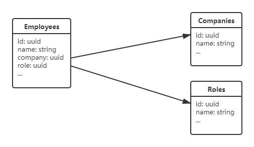

# [通用 REST 接口框架设计 <br/> (Generic REST API)](https://aiportal.github.io/generic-rest-api/)

<br/>

[Generic REST API](https://aiportal.github.io/generic-rest-api/) 是一份接口协议，也是一份设计指导。它在 [RESTful](https://restfulapi.net/) 接口协议的基础上加以扩展，提供了更加丰富的资源操作语义。

[Generic REST API](https://aiportal.github.io/generic-rest-api/) 以资源操作为主，主要实现针对数据库资源的 CRUD (CREATE，READ，UPDATE，DELETE) 操作。

<br/>

## 接口设计示例

### 数据库结构



<br/>

### REST 接口

* **查询数据集**  
GET /employees?fields=id,name,employee(id,name),role

``` json
{
  "id": "5dbf8d279223892968bba2e5",
  "name": "Grand Li",
  "company": {
    "id": "5d77a5800a1cbe995321446b",
    "name": "Headquarters",
  },
  "role": "5d77a58b3be3ed6b1c971aef",
}
```
fields 字段是必须的，它定义了客户端需要获取的所有数据列，包括外键引用的数据表内容。

* **查询单个对象**  
GET /employees/{id}?fields=id,name,employee,role(id,name)

``` json
{
  "id": "5dbf8d279223892968bba2e5",
  "name": "Grand Li",
  "company": "5d77a5800a1cbe995321446b",
  "role": {
    "id": "5d77a58b3be3ed6b1c971aef",
    "name": "Administrator",
  },
}
```
fields 列表未包含嵌套列时，外键引用不展开，仅返回原始的数据列内容。

* **更新单个对象**  
PUT /employees/{id}
``` json
{
  "name": "Grand-Li",
  "company": null,
}
```
更新操作只更新请求体中已包含的字段内容。

* **添加对象**  
POST /employees
``` json
{
  "name": "Grand Li",
  "role": "5d77a58b3be3ed6b1c971aef",
}
```


* ***删除对象***  
DELETE /employees/{id}

<br/>

## 接口实现代码（以 Mongodb 为例）

``` typescript
  public static async loadEmployees(
    preFilter: object,
    postFilter: object,
    fields: string[]
  ): Promise<any[]> {

    const _hasExtension = (name: string) => 
      _(fields).some((x) => x.startsWith(`${name}.`));
    const agg = [
      { $match: preFilter },
      ...(_hasExtension('company') ? COMPANY_LOOKUP : []),
      ...(_hasExtension('role') ? ROLE_LOOKUP : []),
      { $match: postFilter },
    ];

    const project = _(fields)
      .keyBy()
      .mapValues(() => 1)
      .value();

    const employees = await Employees.aggregate(agg).project(project)
    return employees;
  }

  const COMPANY_LOOKUP = [
    {
      $lookup: {
        localField: 'company',
        from: 'companies',
        foreignField: 'id',
        as: 'company',
      },
    },
    {
      $unwind: {
        path: '$company',
        preserveNullAndEmptyArrays: true,
      },
    },
  ]
  const ROLE_LOOKUP = [
    ...
  ]

```
根据 fields 请求的数据列中是否包含外键扩展，动态生成查询语句，按需引入扩展表的内容。  

更多代码请参见：[https://gist.github.com/aiportal/0e99a918559185c1d39bf4ac38faa0ed](https://gist.github.com/aiportal/0e99a918559185c1d39bf4ac38faa0ed)

<br/>

## 通用查询扩展 (Generic query filter)

这是一个延伸话题，也是一个可选项。通过对 URL 查询语句的特殊编码，实现简单的数据筛选。

<br/>

* **查询语句映射** (以 Postgresql 为例)

| &nbsp; **URL filter** |  &nbsp; **SQL filter** |
| :--------- | :--------- |
| name!=value | name <> value |
| name!!=&... | name is null |
| name!!!=&... | name is not null |
| name[]=v1&name[]=v2 | name in (v1, v2) |
| (name=v1&name]=v2 | v1 < name and name <= v2 |
| .name_=value | name like '_value%' |
| {name}=value | custom sql filter |

<br/>

* **批量更新多个对象**  
PUT /employees?company!=5d77a5800a1cbe995321446b
``` json
{
  "role": null
}
```
``` sql
UPDATE employees
SET role = NULL
WHERE company = '5d77a5800a1cbe995321446b'
```

* **批量删除多个对象**
DELETE /employees?company!!=&role!=5d77a58b3be3ed6b1c971aef

``` sql
DELETE employees
WHERE company IS NULL
  AND role <> '5d77a58b3be3ed6b1c971aef'
```

* **简单筛选数据集**  
GET /employees?fields=id,name&company!!!=&role!!!=

``` sql
SELECT id, name
FROM employees
WHERE company IS NOT NULL
  AND role IS NOT NULL
```

<br/>
<br/>
