# [版纳的气候有多宜居？](https://aiportal.github.io/weather-compare/)

 

云南省西双版纳州景洪市，位于云南省最南部，常年气候温暖。

### 景洪与北京全年气温对比（2021）
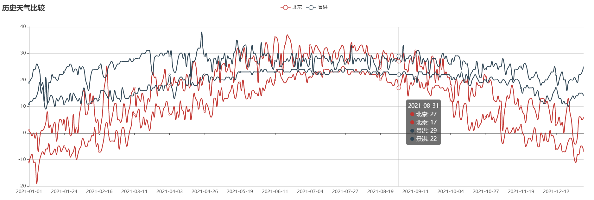
### 景洪与上海全年气温对比（2021）
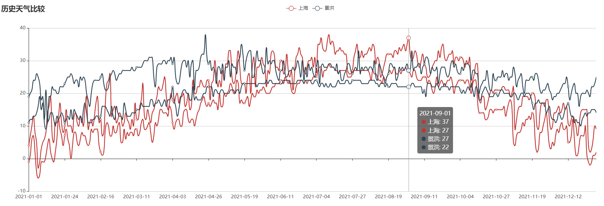
### 景洪与深圳全年气温对比（2021）
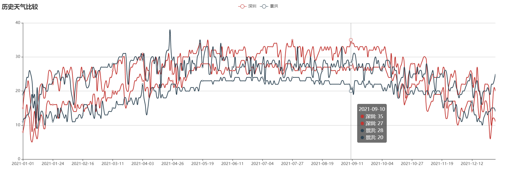

### 景洪与哈尔滨全年气温对比（2021）
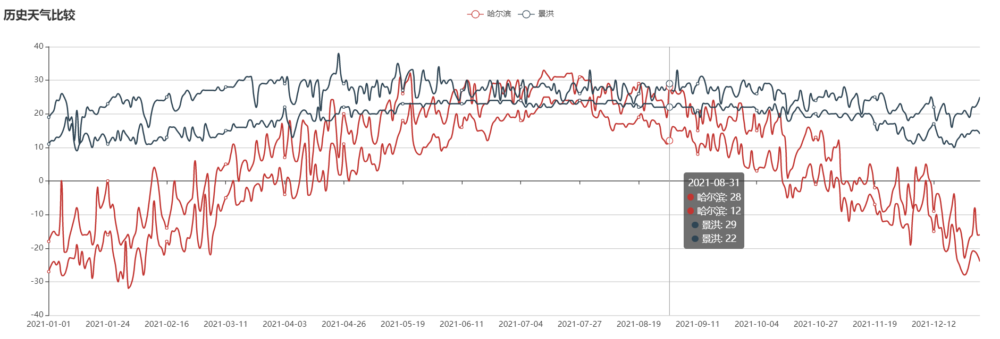
### 景洪与呼和浩特全年气温对比（2021）
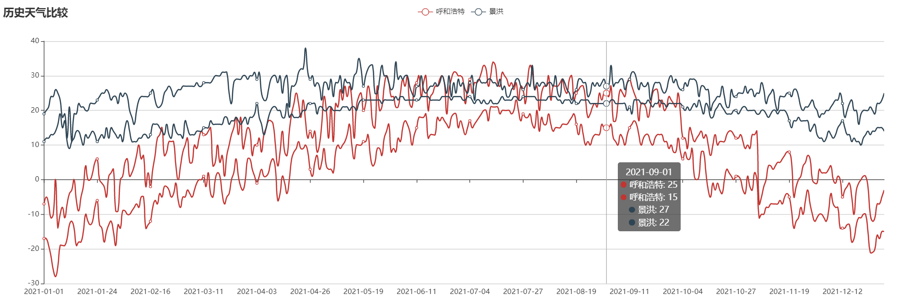
### 景洪与杭州全年气温对比（2021）
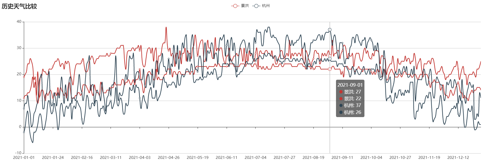
### 景洪与西安全年气温对比（2021）
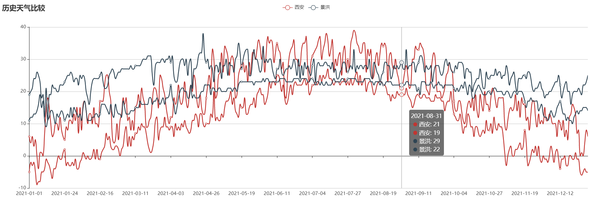
### 景洪与成都全年气温对比（2021）
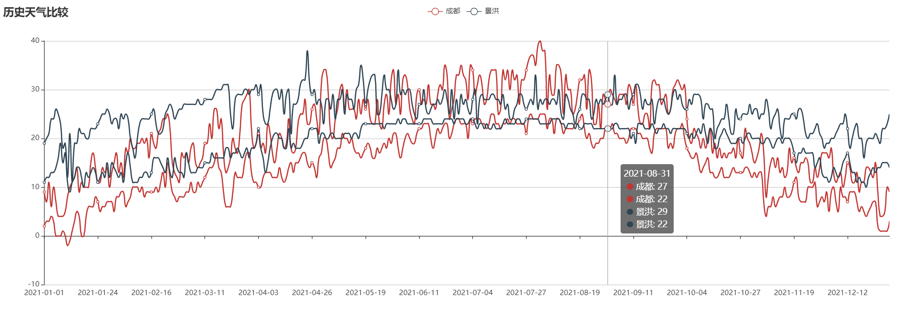
### 景洪与重庆全年气温对比（2021）
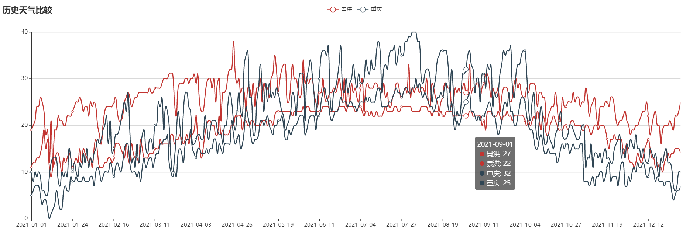
### 景洪与贵阳全年气温对比（2021）
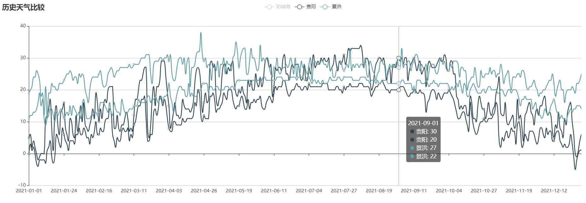
### 景洪与海口全年气温对比（2021）

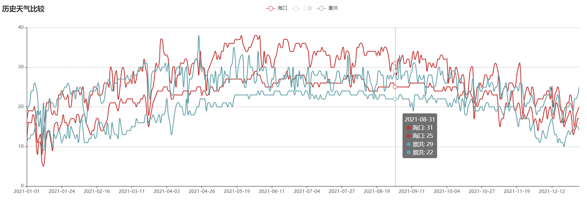
### 景洪与防城港全年气温对比（2021）
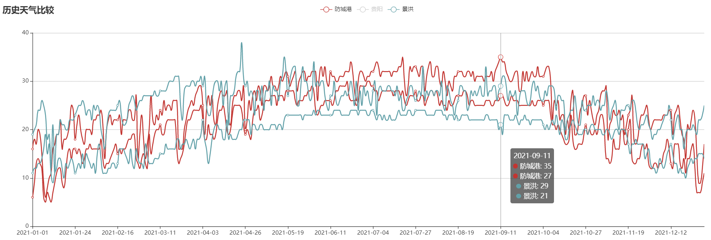
### 景洪与三亚全年气温对比（2021）
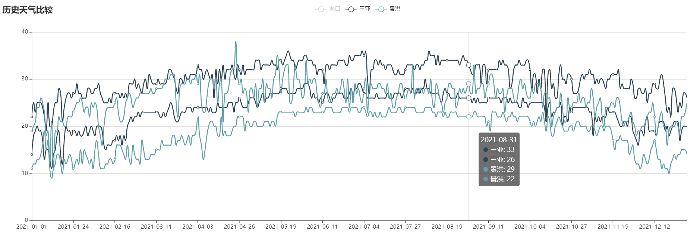
### 景洪与昆明全年气温对比（2021）
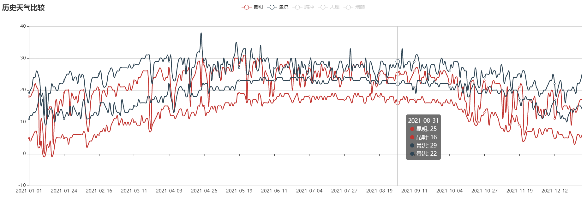
### 景洪与大理全年气温对比（2021）
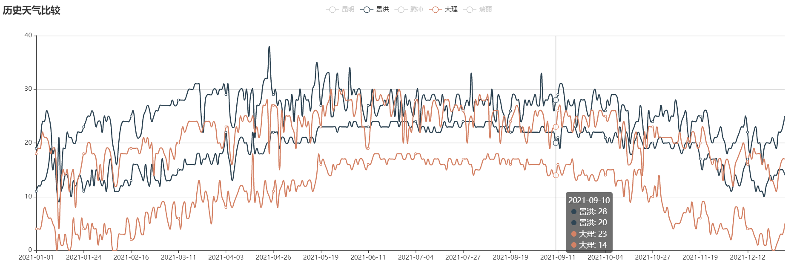
### 景洪与腾冲全年气温对比（2021）
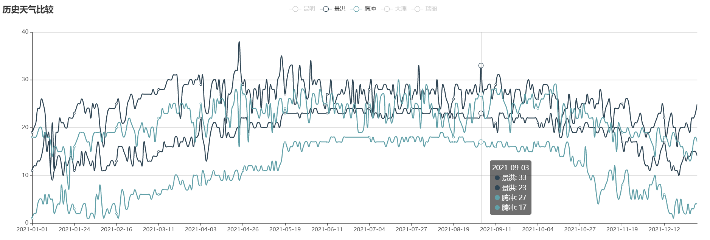
### 景洪与瑞丽全年气温对比（2021）
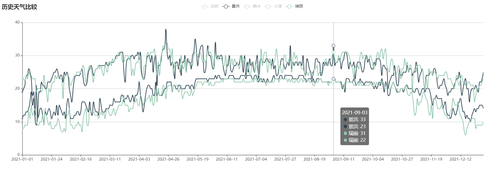
 

## 景洪市2021年全年气温曲线图
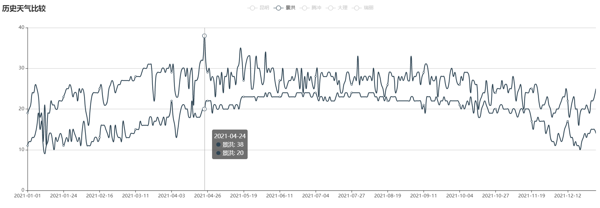

## 景洪市2015~2021年气温变化图
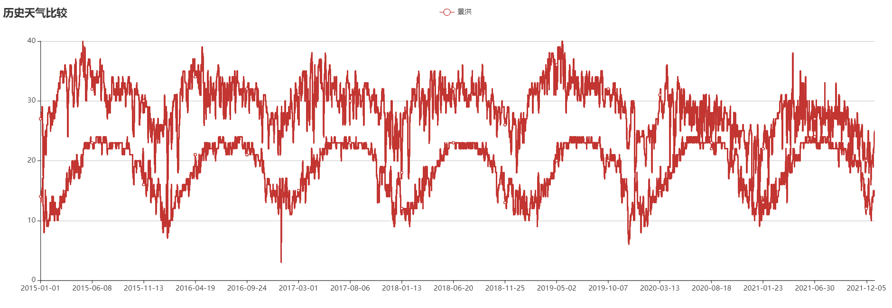

比较奇怪的一点是，景洪市2018年以前的年最高气温还是蛮高的，接近40度，但最近两年很少出现持续高温天气，年最高温度很少超过30度。我查阅了附近的普洱、玉溪、勐海，都没有发现类似的变化趋势，可见这不是地区性的气候变化，仅仅是景洪市区的气温变化。是什么原因造成的这种变化呢？我的猜测是遍布市区的雾化喷淋装置，因为在其他城市很少见到。当然，这只是个人猜测，还需要进一步验证。今年可以考虑在阳台上装几个雾化喷淋装置，测试一下有没有明显的局部降温效果。